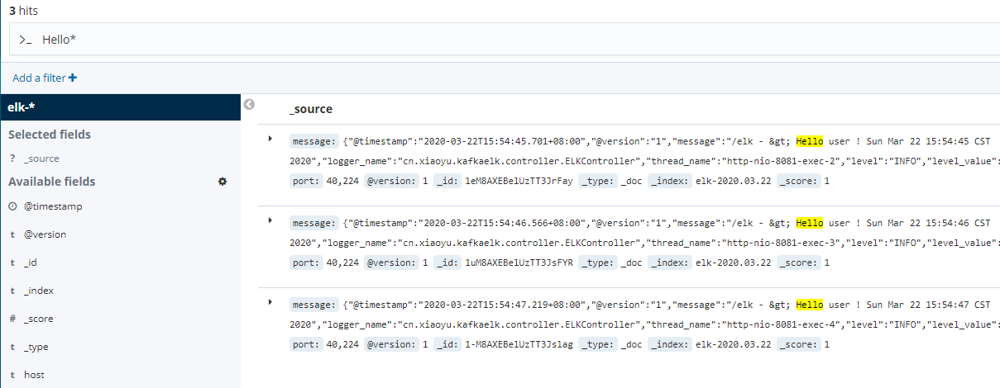

## SpringBoot应用集成ELK

### ELK服务组件
* **Elasticsearch**：用于存储收集到的日志信息；
* **Logstash**：用于收集日志，SpringBoot应用整合Logstash会把日志发送给Logstash,
Logstash再把日志转发给Elasticsearch；
* **Kibana**：通过Web端的可视化界面来查看日志。

### 通过DockerCompose搭建ELK环境
#### 拉取需要的镜像

    docker pull elasticsearch:7.5.1
    docker pull logstash:7.5.1
    docker pull kibana:6.8.6
    
### 环境搭建
将[logstash-springboot.conf](./src/main/resources/logstash-springboot.conf)放置到
`C:\data\logstash`路径下

运行[docker-compose.yml](./src/main/resources/docker-compose.yml)文件
> docker-compose up -a

运行完成后，访问[ES](http://192.168.2.139:9200/)和[Kibana](http://192.168.2.139:5601/)

添加[logback-spring.xml](./src/main/resources/logback-spring.xml)文件，设置logback输出日志
到logstash中

### 运行SpringBoot项目

启动SpringBoot项目，访问[http://localhost:8081/elk](http://localhost:8081/elk)接口

进入Kibana管理界面，添加索引
> Management -> Index Patterns -> Create Index pattern -> add 
index-name.\*为elk-\* -> Create index pattern

检索日志
> Discover -> 选择elk-\*索引 -> 添加filter Hello\*

### 后记

可以在其中添加kafka以及filebeat来稳定日志输出